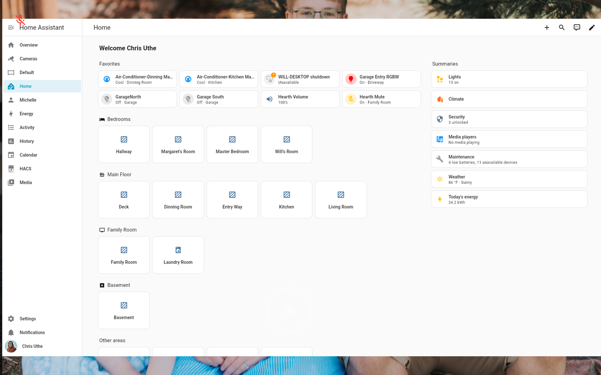
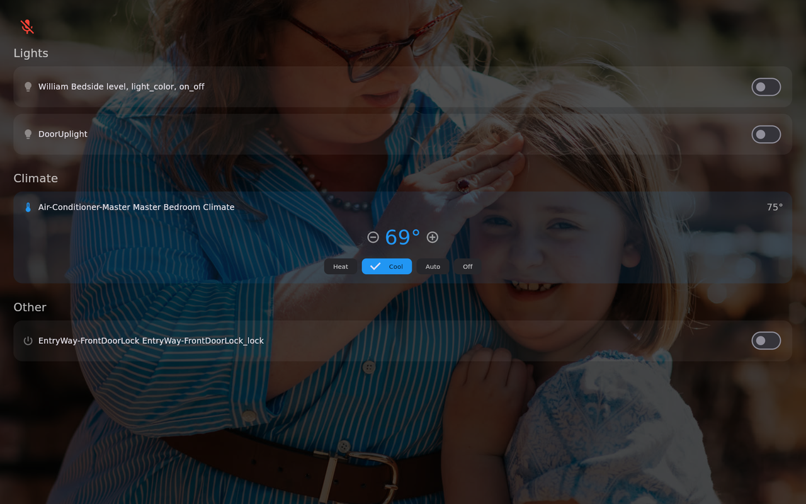
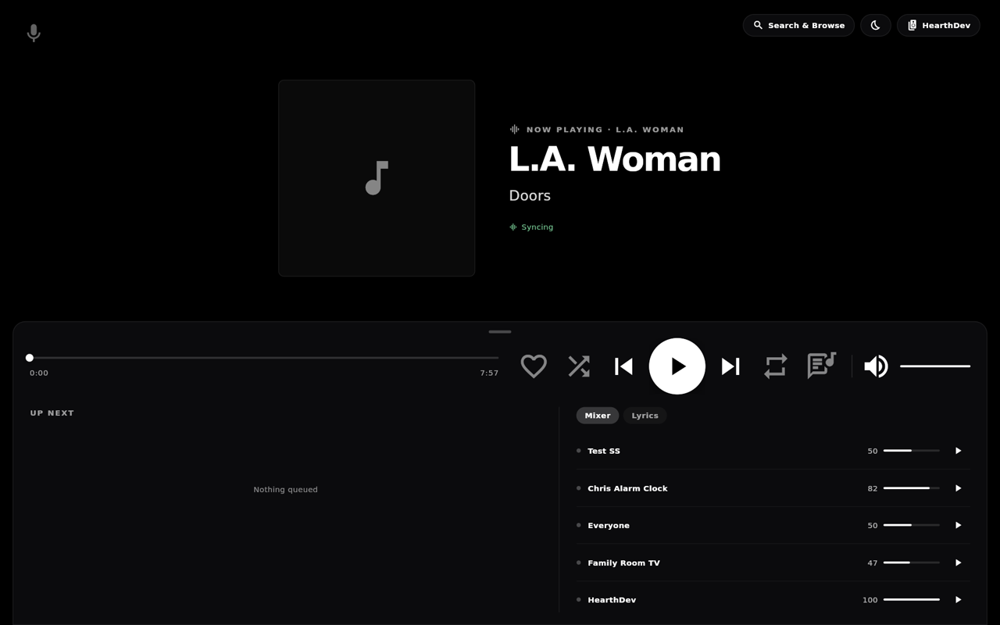
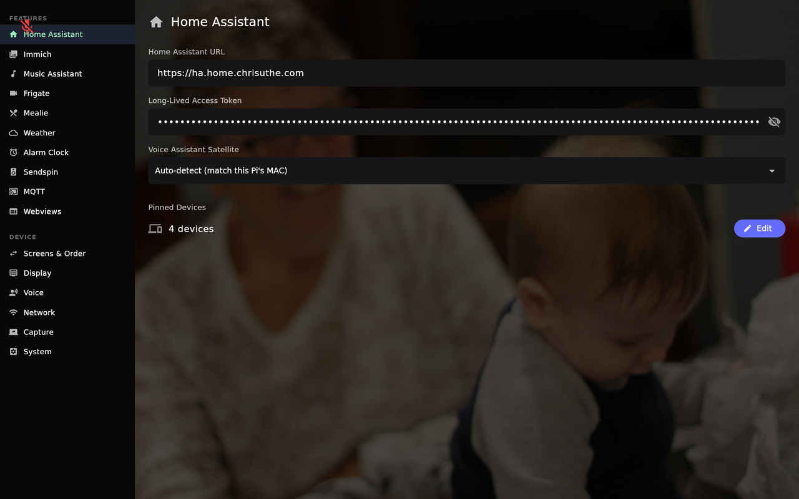

# Hearth

Open-source Flutter smart home kiosk — a Google Nest Hub replacement designed for Raspberry Pi 5 with an 11" AMOLED display, running via [flutter-pi](https://github.com/ardera/flutter-pi).


https://youtube.com/watch?v=pPN4-EoO-Nc&feature=youtu.be

## Features

- **Full-Bleed Photo Display** — Immich memories rotate behind a transparent home screen with clock, weather, and memory labels. Photo sources include "on this day" memories, a chosen album, photos of selected **people**, and free-text **smart search** (CLIP) — e.g. "beach" or "snow". The ambient crop is **face-aware**, biasing toward detected faces so people aren't cut off.
- **Embedded Web Dashboards** — Render Home Assistant Lovelace dashboards (or any URL) as first-class swipe screens via WPE WebKit. Full touch (tap, long-press, vertical scroll), pipelines suspend when the kiosk goes idle and auto-restart on error, and HA dashboards are **token-injected** so they load already signed in.
- **Home Assistant Controls** — Lights and climate cards over the HA WebSocket. Pin your most-used entities for quick access.
- **Music Assistant** — Media playback with album art, transport controls, volume slider, and multi-zone support.
- **Frigate Cameras** — Live RTSP video streams from go2rtc with a snapshot grid. Tap a camera for full-screen live video; playback suppresses the idle timeout so streams aren't interrupted.
- **Recipes** — Browse and view recipes from Mealie with category filtering.
- **Alarm Clock** — Scheduled alarms (recurring or one-time), separate from countdown timers, with optional sunrise lights, snooze, and Music Assistant or built-in alarm sounds.
- **Timers** — Countdown timers with full-screen alerts that show over any screen.
- **Voice Satellite** — Mute/unmute the mic on a Home Assistant Assist satellite and show a voice-activity pill during interactions.
- **Home Assistant Device (MQTT)** — Hearth registers itself over [MQTT discovery](docs/home-assistant-mqtt-setup.md) as a single HA device, exposing its current screen, now-playing, timer, next-alarm, and a controllable volume — and reporting its installed version as the device firmware.
- **Multi-Room Audio (Sendspin)** — Act as a Music Assistant audio player for synchronized multi-room playback, with mDNS auto-discovery.
- **System Volume** — Quick-access volume slider via configurable swipe menu.
- **Configurable Gestures** — Top and bottom edge swipes can be mapped to menus, settings, or screen navigation.
- **Night Mode** — Triggered by clock schedule, HA entity state, or external API call.
- **Web Portal** — A full configuration portal at `http://hearth.local:8090` with near-complete parity to the on-device Settings: service setup, HA entity pickers, Immich photo-source pickers, screen enable/reorder, alarm editing, timezone, update source, capture tools, and more.
- **OTA Updates** — Automatic app-bundle updates from GitHub or Gitea releases, with a selectable update source, manual force-update, a self-refreshing updater, and systemd rollback to the previous bundle on repeated failures.

## Screenshots

Captured from a live Hearth kiosk (Raspberry Pi 5, 11" AMOLED).

| Home — photo display | Embedded HA dashboard (Webview) |
| --- | --- |
|  |  |

| Home Assistant Controls | Music Assistant |
| --- | --- |
|  |  |

| Frigate Cameras | Settings — plugin sidebar |
| --- | --- |
|  |  |

## Install on Raspberry Pi

### What You Need

- Raspberry Pi 5 (2GB or more)
- MicroSD card (8GB+)
- Display (HDMI monitor, official 7" touchscreen, or 11" AMOLED)
- Ethernet or WiFi connection

### Step 1: Flash Pi OS

Download and flash **Raspberry Pi OS Lite (64-bit)** using [Raspberry Pi Imager](https://www.raspberrypi.com/software/).

In the imager settings, configure:
- **Enable SSH** (so you can connect remotely)
- **Set username and password**
- **Configure WiFi** (if not using ethernet)

### Step 2: Run the Setup Script

SSH into the Pi and run:

```bash
curl -sL https://raw.githubusercontent.com/chrisuthe/Hearth-Home/main/scripts/setup-pi.sh | sudo bash
```

This does everything automatically:
- Installs dependencies (GStreamer, Mesa, WPE WebKit, etc.)
- Builds flutter-pi from the [Hearth fork](https://github.com/chrisuthe/flutter-pi-hearth/tree/hearth) (patched for a live video pipeline)
- Downloads the latest app bundle from GitHub Releases
- Configures systemd services — including a rollback service that reverts to the previous bundle if the app fails to start repeatedly — and starts Hearth

The kiosk starts automatically after setup completes.

### Step 3: Configure From the Web Portal

Open a browser on any device on your network and go to:

```
http://hearth.local:8090
```

Enter the PIN shown on the kiosk display. The portal mirrors the on-device Settings as a plugin sidebar, so almost everything can be set up from the browser:

- **Home Assistant** — WebSocket URL + long-lived access token; pick pinned entities, the voice satellite, and the night-mode entity
- **Immich** — Server URL + API key, then choose photo sources (memories, albums, people, smart search)
- **Frigate** — Server URL (for camera streams, optional)
- **Music Assistant** — Server URL + token (optional)
- **Mealie** — Server URL + token (for recipes, optional)
- **Web Dashboards** — Add Home Assistant Lovelace dashboards or arbitrary URLs as swipe screens
- **MQTT** — Broker URL (+ optional credentials) to expose Hearth as a Home Assistant device (see [docs/home-assistant-mqtt-setup.md](docs/home-assistant-mqtt-setup.md))
- **Screens & Order** — Enable/disable screens and set their swipe order
- **Alarms**, **Timezone**, **Update source**, and **Network** (WiFi, PIN, portal URL + QR code)

The PIN gates the portal; an auto-generated API key (in the Pi's `hub_config.json`) lets scripts drive the same `/api/*` endpoints with a `Bearer` token.

### Updating

Hearth checks for updates daily and on boot, from your selected source (GitHub or Gitea). Force an update from the portal's **Updates** panel, or manually:

```bash
sudo systemctl start hearth-updater.service
```

Re-running the setup script also updates everything:

```bash
curl -sL https://raw.githubusercontent.com/chrisuthe/Hearth-Home/main/scripts/setup-pi.sh | sudo bash
```

## Architecture

### Navigation

Swipe-based horizontal navigation. The screens and their order are configurable; by default:

**Music ← Alarm ← Home → Controls → Cameras → Recipes → Settings**

Any **Web Dashboards** you add appear as additional swipe screens in their configured position. The Home screen is transparent over the photo carousel — photos are always visible — while other screens use a dark background for readability.

Configurable edge swipe menus slide in from top/bottom without dimming the background.

### Module System

Optional screens implement the `HearthModule` interface (`lib/modules/hearth_module.dart`). Each module provides a screen, a settings section, and enable/disable + placement support. The registered modules are **Alarm Clock, Music, Controls, Cameras, and Recipes (Mealie)** (`lib/modules/module_registry.dart`). **Web Dashboards** are dynamic: one `WebviewModule` is synthesized per configured dashboard, so they aren't a fixed entry in the list — they're driven by your config.

### Embedded Web Dashboards (WPE)

Webview screens render web content with **WPE WebKit** through a GStreamer `wpevideosrc` pipeline composited into the Flutter scene. Touch is mapped through to the page (tap, long-press, vertical scroll), while horizontal drags pass through to the outer PageView for swipe navigation. Pipelines suspend when the kiosk goes idle and auto-restart after errors. For Home Assistant dashboards, an init script injects the long-lived token into the page's `localStorage` at document start, so the dashboard loads already authenticated.

### Plugin Settings & Web Portal

Settings are organized as **plugins** (`lib/plugins/`). Each plugin renders itself twice from one definition: a Flutter widget for the on-device Settings sidebar and an HTML fragment for the `:8090` web portal — which is why the portal stays at near-full parity with the device. The portal is served by `LocalApiServer` (`lib/services/local_api_server.dart`): the page is PIN-gated, and the `/api/*` endpoints accept either the web-session cookie or a `Bearer` API key.

### Home Assistant Device (MQTT)

When an MQTT broker is configured, Hearth publishes [MQTT discovery](docs/home-assistant-mqtt-setup.md) config so a single **Hearth** device appears in Home Assistant. It exposes its current screen, now-playing, timer state, and next alarm as sensors, plus a controllable **volume** number, and reports its installed app version as the device's firmware version.

### Video on Pi

Live camera streams use GStreamer via flutter-pi's video player plugin. Hearth builds flutter-pi from its own [fork](https://github.com/chrisuthe/flutter-pi-hearth/tree/hearth), whose `hearth` branch patches `player.c` to fix a live pipeline initialization deadlock — custom pipelines go straight to PLAYING state instead of stalling in PAUSED.

### Key Technologies

- **Flutter** + **Riverpod** for UI and state management
- **flutter-pi** for Raspberry Pi rendering (DRM/KMS + EGL)
- **GStreamer** for RTSP video playback on Pi; **WPE WebKit** for embedded web dashboards
- **media_kit** (libmpv) for video on desktop
- **Home Assistant WebSocket API** for device control and events

## Development

### Desktop (Windows/Linux)

```bash
flutter pub get
flutter run -d windows   # or -d linux
```

### Run Tests

```bash
flutter test
flutter analyze
```

### Target Hardware

- Raspberry Pi 5
- 11" AMOLED (2368x1728, rendered at 1184x864 for performance)
- Also supports: Official RPi 7" touchscreen, generic HDMI monitors

### Releasing

Hearth ships from two remotes and devices update from one or the other, so every
merge and every release must be pushed to **both** or a platform's devices fall
behind. The full end-to-end process — branch sync, version bump, tagging, wiki,
and CI verification — lives in **[docs/RELEASING.md](docs/RELEASING.md)**.

The short version:

```bash
./scripts/sync-remotes.sh          # after a merge: push main to both remotes
./scripts/release.sh --bump 1.13.3 # cut a release: bump, tag, push the tag to both
```

## License

MIT
