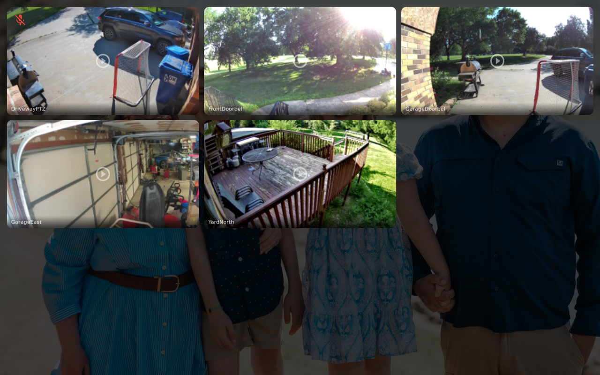

# Cameras (Frigate)

The **Cameras** screen shows a live snapshot grid of your [Frigate](https://frigate.video/)
cameras. Tap any camera to open a full-screen live video stream.

## Connect Frigate

In the [[web portal|The Web Portal]], open **Frigate** and enter:

| Field | Example | Notes |
| --- | --- | --- |
| **Frigate URL** | `http://192.168.1.x:5000` | Your Frigate server (required) |
| **Username** | `admin` | Only if your Frigate has authentication |
| **Password** | *(your password)* | Only if your Frigate has authentication |

Many Frigate installs have **no authentication** — in that case leave username and password
blank. If you fill in one but not the other, the portal flags the plugin as *partial*
(incomplete credentials); either fill both or clear both.

Hearth loads your camera list from the Frigate API, so once the URL is set the cameras appear
automatically.

## Using the Cameras screen

- **Snapshot grid** — each camera shows a thumbnail that refreshes every few seconds.
- **Full-screen live** — tap a camera to open its live RTSP stream (served via go2rtc). On the
  Pi this plays through the GStreamer video pipeline.
- **Idle suppression** — while you're watching a live stream, Hearth **won't** time out and
  return to Home, so the video isn't interrupted.
- **Offline handling** — if a camera is unreachable, its tile reflects that rather than
  hanging.

## Troubleshooting

- **Cameras are black / won't play** — confirm the Frigate URL is reachable from the Pi and,
  if your Frigate uses auth, that both username and password are set. See
  [[Troubleshooting & FAQ]].
- **No cameras listed** — Hearth reads the camera list from Frigate; make sure your cameras
  are configured and visible in Frigate itself.
