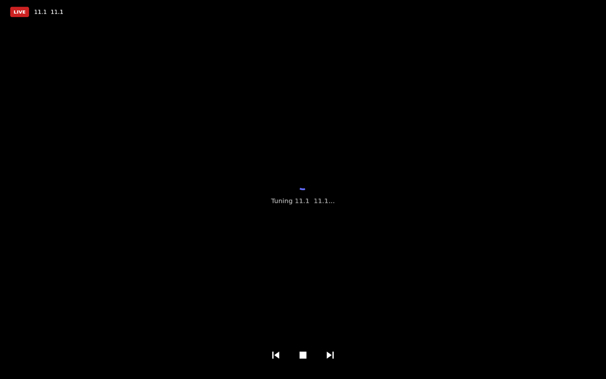

# Live TV (Plex)

The **Live TV** screen turns the kiosk into a channel surfer for the tuner attached to your
Plex Media Server — an HDHomeRun feeding a Plex DVR. Swipe to the screen, tap a channel, and it
tunes and plays full-screen.

This is the mirror image of **[[Plex Cast]]**: there, Plex apps push video *to* Hearth; here,
Hearth acts as the Plex *client* and starts playback itself. Both share one pairing.

*Tuning a channel. 📷 A shot of the channel grid itself is still needed — see [[SHOTLIST]].*

## What you need

- A **Plex Media Server** you own, with a **DVR** configured — i.e. a tuner (HDHomeRun) and a
  channel lineup already working in Plex.
- Hearth **paired with your Plex account**. Set the Player Name and pair from
  **Settings → Plex Cast** on the kiosk; see [[Plex Cast]] for the walkthrough.

Pairing is the hard requirement. An enabled-but-unpaired Plex player can still receive casts,
but Live TV needs the account token to find your server and its DVR — so the screen shows
*"Pair Plex in Settings to watch Live TV."* until you pair.

## Turn the screen on

Live TV is a module like any other. Open **Screens & Order** in the
[[web portal|The Web Portal]], enable **Live TV**, and give it a placement (the swipe row, or
one of the edge menus). By default it sits between **Controls** and **Cameras** — see
[[Navigation & Gestures]].

## Using it

**The channel grid** — tiles laid out in a grid, each showing the channel **number** in accent
colour above its **call sign**. The list comes from your DVR's lineup; Hearth resolves your
server and channels the first time you land on the screen.

**Tune** — tap a tile. The screen goes full-screen with a spinner and *"Tuning 7.1 KABC…"*
while the tuner locks and the stream warms up, then the picture comes in.

A cold tuner lock genuinely takes a while — Hearth allows up to **90 seconds** for the tune
itself and a further **60 seconds** to get a picture up. Those ceilings exist so a server that
accepts the request and then goes quiet can't leave you on a spinner forever while still
holding a tuner. If either is hit, the error shows on screen.

**While watching:**

- A red **LIVE** badge and the channel number + call sign sit in the top-left.
- Three controls sit along the bottom: **previous channel**, **stop**, **next channel**. There's
  no scrubber — it's live.
- Channel up/down walks the same lineup as the grid, re-tuning each time.

**Stopping** — tap **stop** to return to the grid. Hearth **tears the tuner grab down on every
exit path**, including errors and timeouts, so a tuner isn't left allocated after you walk away.

The screen holds off the [[idle timeout|Navigation & Gestures]] while a channel is playing, so
a show won't be interrupted by the kiosk returning to Home.

## Troubleshooting

- **The grid is empty / "Pair Plex in Settings"** — Hearth couldn't resolve an owned server or
  a DVR from your account. Confirm you're **paired** (Settings → Plex Cast shows *Paired with
  Plex*), that the Plex account owns the server, and that the server has a working DVR. Both
  failure stages log a distinct warning under `LiveTV` — check the
  [logs page](The-Web-Portal#the-logs-page).
- **Tuning spins then errors** — usually a tuner that's already in use (another Plex client
  watching or recording) or a channel that won't lock. Try another channel.
- **Playback stutters** — live channels are transcoded by Plex; check the server's transcoder
  load. See also the direct-play notes in [[Plex Cast]].
- **The screen isn't in my swipe row** — enable it under **Screens & Order**; see
  [[Navigation & Gestures]].
