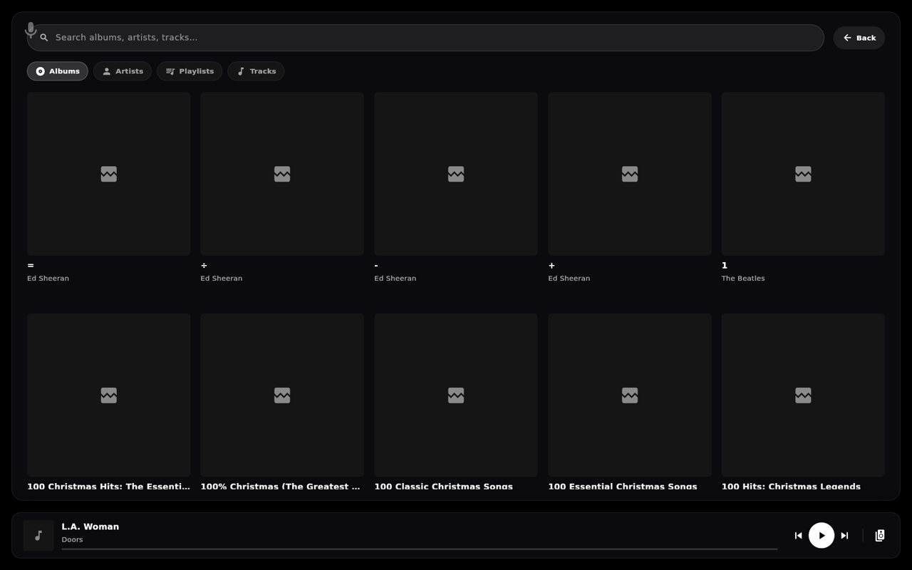

# Music Assistant

The **Music** screen is a full-bleed, cinematic now-playing player backed by
[Music Assistant](https://music-assistant.io/): album art bleeds edge to edge behind the track,
a drag-up shelf holds the transport and queue, and a browse overlay searches your whole library.
Music Assistant connects **directly** — it does not depend on Home Assistant.

## Connect Music Assistant

In the [[web portal|The Web Portal]], open **Music Assistant** and enter:

| Field | Example | Where to get it |
| --- | --- | --- |
| **Music Assistant URL** | `http://192.168.1.x:8095` | Your Music Assistant server |
| **Music Assistant Token** | *(paste it)* | A Music Assistant long-lived token |

Until it connects, the screen shows **"Music Assistant not connected"** with a pointer back to
Settings.

## Options

- **Default Music Zone** — the player Hearth controls by default, as a `media_player` entity
  ID (e.g. `media_player.living_room`). If you leave it blank, the connection still works but
  the plugin is marked *partial* — set a default so the Music screen opens on the right player.

## Using the Music screen

**The backdrop** is built from the current track's album art, so the whole screen takes on the
colour of what's playing. Tracks without art fall back to a plain dark background.

**The hero** shows the album art alongside a `NOW PLAYING · <track>` eyebrow, the track title,
and the artist.

**The top chrome** is a row of chips:

- **Search & Browse** — opens the library overlay (below).
- **Players** — shows the active player's name; tap to switch zones.

**The shelf** along the bottom is a **drag drawer**, not a fixed panel. It starts *minimal* —
just the transport. Drag it **up** and it grows to *expanded*; let go and it snaps to whichever
stop is nearer. It tracks your finger the entire way rather than animating on release.

What appears as it rises:

- **Minimal** — the transport row and the progress bar with elapsed / total time.
- **Lift it off the bottom** — the **Up Next** queue lane slides in, showing what's coming
  (or *"Nothing queued"*).
- **Expanded** — the right pane appears with a **Mixer** tab: every Music Assistant player
  listed with a playing indicator, its own **volume slider**, and a play button — so you can
  balance a multi-room group without leaving the screen.

**The transport row**, left to right: shuffle, previous, play/pause, next, **repeat** (tap to
cycle *off → all → one*), queue, and the active player's volume. Shuffle and repeat dim when
inactive.

**Switching zones** — tap the **Players** chip to open the popover and pick which Music
Assistant player you're driving. Only players Music Assistant reports as available are listed.

> **Not wired up yet:** the **heart**, the **Sleep** chip, and the **Lyrics** tab are drawn but
> currently do nothing. They're placeholders for planned features, not broken settings.

## Browsing your library

Tap **search** in the top chrome to open the **browse overlay**.

- **Search** — one box across **albums, artists, and tracks**; results are grouped by type. It
  searches as you type.
- **Tabs** — with the search box empty, browse the library by **Albums**, **Artists**,
  **Playlists**, or **Tracks** as a grid.
- **Tap any tile** for its actions: **Play Now**, **Play Next**, **Add to Queue**, or
  **Clear Queue & Play**.

While the overlay is open, a **mini bar** stays pinned at the bottom so you keep play/pause,
next/previous, and the zone switcher without closing it.

## Troubleshooting

- **"Music Assistant not connected"** — confirm the URL and token are correct and the server is
  reachable from the Pi.
- **Connected, but no player** — set **Default Music Zone** to a real `media_player` entity, or
  pick one from the players popover. Players that Music Assistant reports as unavailable are
  filtered out.
- **Multi-room out of sync** — that's a Music Assistant concern; also see
  **[[Multi-Room Audio (Sendspin)]]** if you want Hearth itself to be a synced player.
- **I want to cast video, not music** — see [[Cast to Hearth (DLNA)]] and [[Plex Cast]].
