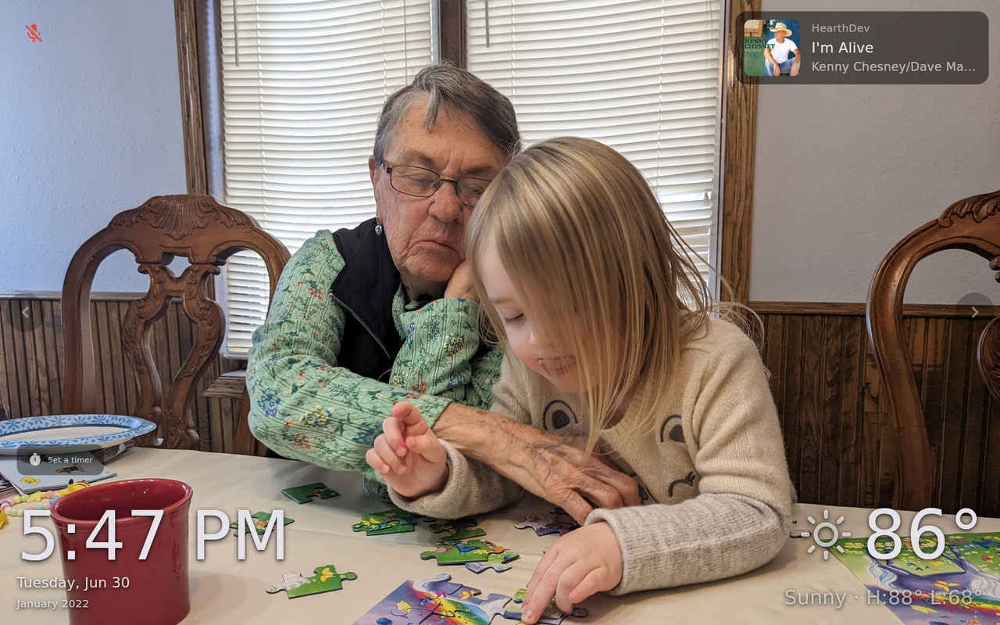

# Photos & Ambient Display

The Home screen is transparent — your photos are *always* the background. Hearth pulls
them from [Immich](https://immich.app/), your self-hosted photo library, and rotates them
behind an ambient clock, weather, and memory label. This page covers connecting Immich,
the four photo sources, and the ambient overlays.

## Connect Immich

In the [[web portal|The Web Portal]] (`http://hearth.local:8090`), open **Immich** in the
sidebar and enter:

| Field | Example | Where to get it |
| --- | --- | --- |
| **Immich URL** | `http://192.168.1.x:2283` | Your Immich server address |
| **API Key** | *(paste your key)* | Immich → **Account Settings → API Keys → New API Key** |

Once the URL and key are saved, the **Photo sources** section below them comes to life and
loads your albums and people.

## Photo sources

Photo sources are independent toggles — enable as many as you like and Hearth **unions and
shuffles** them into one carousel (each enabled source contributes up to ~50 photos).

### Memories ("On This Day")
On by default. Shows Immich's "on this day" memories — photos from this date in past years.
No extra configuration.

### Album
Toggle it on, then pick one album from the dropdown (each entry shows its name and photo
count). If you enable Album but don't pick one, the portal warns you the source is
incomplete.

### People
Toggle it on to show photos of specific people. Immich's face recognition powers this —
tagged, named people appear as chips (with a photo count each); tap to select one or more.

> If you see *"No named people found in Immich. Tag faces in Immich first."*, go tag and
> name some faces in Immich, then reopen this panel.

### Smart search
Toggle it on and type a free-text query — Hearth uses Immich's CLIP smart search to find
photos that *look like* your query. It searches image content, not filenames.

- Placeholder: *"e.g. beach, sunset, autumn leaves"*
- Works best for visual concepts like `beach` or `sunset`.

## Face-aware cropping

Photos are cropped to fill the panel, but the crop is **face-aware** — it biases toward
detected faces so people don't get cut off at the edge.

## Ambient overlays: clock & weather

When the kiosk is idle, the ambient layer fades in over your photos: a large **clock**, the
current **weather**, and the **memory label** for the photo on screen.

- **Clock format** — the 12-hour / 24-hour toggle lives on the **[[Display|Display & Night Mode]]**
  page (**Use 24-Hour Clock**).
- **Weather** — open **Weather** in the portal sidebar and set the **Weather Entity ID** to a
  Home Assistant weather entity (e.g. `weather.pirate`). This reuses your
  [[Home Assistant connection|Home Assistant Controls]], so no separate URL or key is needed.

*📷 Planned screenshot — the Immich panel at `:8090` showing the four photo-source toggles. See [[SHOTLIST]].*

## Troubleshooting

- **No photos appear** — confirm the Immich URL is reachable from the Pi and the API key is
  valid. See [[Troubleshooting & FAQ]].
- **A source is enabled but empty** — the portal shows a warning; make sure you picked an
  album / at least one person / entered a search query.
