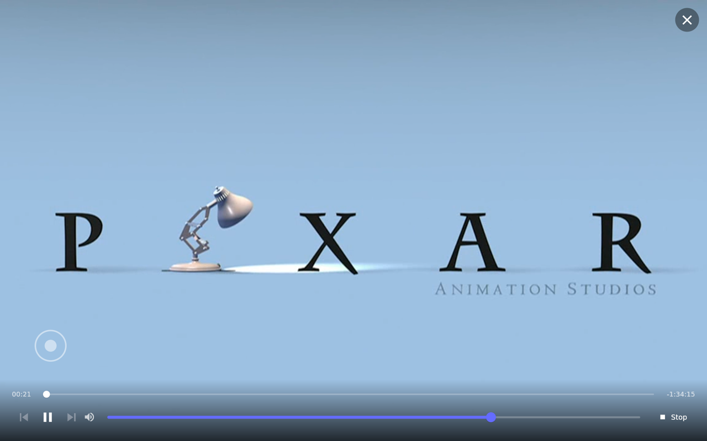

# Plex Cast

Hearth can advertise itself on your network as a **Plex player**, so the Plex apps on your
phone, tablet, browser, or desktop show the kiosk as a cast target. Pick it, hit play, and the
video takes over the screen full-bleed.

This is the *cast-sink* side of Plex — Plex apps push to Hearth. If you want to browse and
start live channels **from** the kiosk instead, see **[[Live TV (Plex)]]**, which uses the same
pairing.

## Set it up

Open **Plex Cast** in the [[web portal|The Web Portal]] or on-device Settings:

| Field | Example | Notes |
| --- | --- | --- |
| **Player Name** | `Hearth` | Required. The name Plex apps show in their cast list. |
| **Enable Plex Player** | *(toggle)* | Disabled until you've set a Player Name. |

> **First-time enable must be done on the kiosk.** Toggling *Enable* on-device generates the
> stable client ID that Plex uses to identify this player. The web checkbox writes the toggle
> but does **not** seed that ID, so enable it once from the device — after that either surface
> is fine. This is the same caveat as [[Cast to Hearth (DLNA)]] and
> [[Multi-Room Audio (Sendspin)]].

## Pair with your Plex account

Pairing is **on-device only** — the web portal doesn't offer it.

1. On the kiosk, open **Settings → Plex Cast**.
2. Tap **Pair with Plex**. A four-character code appears.
3. On any other device, go to **[plex.tv/link](https://plex.tv/link)** and enter the code.
4. The kiosk polls until you finish, then shows **Paired with Plex**.

The code is good for about two minutes. If it expires, tap **Pair with Plex** again. There's an
**Unpair** button once paired, which clears the stored token.

**Do you have to pair?** It depends what you want:

| State | What works |
| --- | --- |
| Named, enabled, **not** paired | Casting from Plex apps **on the same network**, but **direct-play only** — anything needing a transcode won't play (see below). The plugin shows as *partial*. |
| Named, enabled, **paired** | Everything: transcoded content, reachability beyond the LAN, and **[[Live TV (Plex)]]**. |

> **Pair it.** Transcoding requires your Plex *server* token, which Hearth only has once
> you've paired — the short-lived token that arrives with a cast can't authorize a transcode.
> So on an unpaired player, an HEVC or 4K or 1080i item fails to start rather than falling back.
> Pairing takes about a minute and removes the whole class of problem.

## Using it

Start playback from any Plex app and pick your player name from its cast/player selector. The
video goes full-screen on the kiosk, scaled to fill (aspect preserved, overflow cropped), and
Hearth wakes from idle automatically.

**On-screen controls** — tap the video to reveal the transport bar; it auto-hides after four
seconds:

- **Scrubber** — drag to seek, with elapsed time on the left and time remaining on the right.
- **Previous / Play-Pause / Next** — previous and next are enabled only when the play queue
  actually has something in that direction.
- **Volume** — a slider for the kiosk's output.
- **Stop** — ends the cast. There's also an **✕** in the top-right that's always visible,
  whether or not the transport bar is showing.

**Skip Intro** — while playback is inside an intro marker, a **Skip Intro** button sits at the
bottom-right. It stays put independently of the transport bar, so you don't have to tap the
video first.

**Next Episode** — during the credits marker, and only when there's a next item in the queue,
the same corner shows **Next Episode** to jump straight on.

**Play queue** — when you cast a queue (a season, an album, a playlist), Hearth follows it:
prev/next navigate it, and playback **auto-advances** to the next item when one finishes.

## Direct play vs. transcode

Hearth asks your Plex Media Server to make a playback decision, but keeps a **local guard**
that the server's answer can't override: content the guard rejects is transcoded regardless of
what the server says. In practice the Pi 5 **direct-plays progressive H.264 up to 1080p**, and
**HEVC, 4K, and interlaced (1080i) sources are transcoded** — to H.264 1080p at 6 Mbps.

The guard wins deliberately — letting the server's decision override it silently reintroduced
an interlaced-playback bug. If you're curious which route a given item took, the reason is
logged; see [the logs page](The-Web-Portal#the-logs-page).

## Troubleshooting

- **Hearth doesn't appear in the Plex app's cast list** — confirm you enabled the player
  **on the device** at least once (see the callout above), that the Player Name is set, and
  that the casting device is on the same network as the Pi. Player discovery is LAN-local
  until you pair.
- **"I cast it and nothing happened"** — this is what the logs are for. Cast routing, the
  transcode decision and its source, and a stalled-playback warning are all logged at info /
  warn level. Open **Logs** in the web portal and look for `Plex` entries.
- **Some items won't start at all** — if they're HEVC, 4K, or 1080i, this is almost certainly
  the unpaired-transcode case above. Pair the player.
- **Playback starts then freezes** — a warning is logged when a stream reports *playing* but
  its position hasn't moved for ten seconds. That's diagnostic only; Hearth won't restart it
  for you. Stop and re-cast.
- **Live TV is missing** — that module needs a **paired** account, not just an enabled player.
  See [[Live TV (Plex)]].
