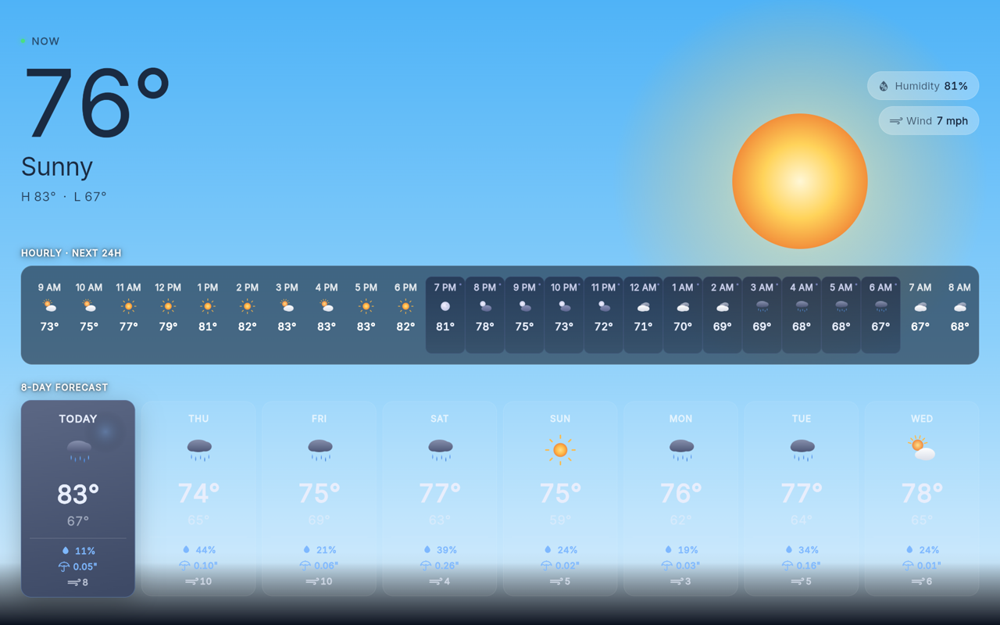

# Weather

Hearth shows weather in two places: a compact **ambient readout** on the Home screen, and a
**full-screen forecast** with animated weather scenes that you open by tapping it.

Both are driven by a single Home Assistant **weather entity** — Hearth doesn't talk to any
weather service directly.

## Connect it

In the [[web portal|The Web Portal]] or on-device Settings, open **Weather**:

| Field | Example | Where to get it |
| --- | --- | --- |
| **Weather Entity ID** | `weather.pirate` | Any `weather.*` entity in your Home Assistant |

That's the whole plugin. It needs a working [[Home Assistant connection|Home Assistant Controls]],
since the forecast data arrives over the same WebSocket.

Which forecast detail you get depends on the entity: hourly and daily forecasts, humidity,
wind speed, and precipitation are all shown **only when your entity provides them**. A weather
integration with richer data gives you a richer screen.

## The ambient readout

On the Home screen, the bottom-right corner shows the current condition icon, the temperature,
and a `Sunny · H:83° L:67°` line under it. It fades in with the clock when the kiosk goes idle —
see [[Photos & Ambient Display]].

If no weather entity is configured or it hasn't reported yet, this shows `--°`.

## The forecast screen

**Tap the ambient temperature** to open it. Dismiss by **tapping anywhere** or **swiping
down**.

The background is an **animated scene matched to the current condition** — rain and snow fall,
clouds drift, lightning flashes, fog rolls, the sun or stars come out. Rain and snow also have
an intensity: Home Assistant's `pouring` and `hail` conditions render heavier than plain rain.

Sun and night are handled by wall-clock time, so a "sunny" reading after dark draws the
**clear night** scene rather than a midnight sun.

The content over the scene, top to bottom:

- **Now** — the big current temperature, the condition label, a high/low line, and chips for
  **Humidity** and **Wind** when the entity reports them.
- **Hourly · Next 24h** — a scrolling strip of the next 24 hours. Each cell picks its own
  day/night icon, so you can see the sun set across the strip.
- **8-Day Forecast** — a row of day cards with condition, high, and low. **Today** is labelled
  and highlighted.

**Tap any day card** for a detail screen with that day's condition, high/low, and whichever of
**Chance of rain**, **Total rain**, **Humidity**, and **Wind** the forecast includes, plus that
day's hours.

Times follow your **Use 24-Hour Clock** setting from [[Display & Night Mode]].

## Troubleshooting

- **The ambient readout shows `--°`** — no weather entity is set, the entity ID is wrong, or
  Home Assistant isn't connected. Check the entity exists in HA (Developer Tools → States) and
  see [[Home Assistant Controls]].
- **Tapping the temperature does nothing** — the forecast screen only opens once weather data
  has actually arrived. If the readout is `--°`, there's nothing to open.
- **No hourly strip or forecast row** — your weather entity isn't publishing those forecasts.
  This is an integration-side limitation; the sections are hidden rather than shown empty.
- **Humidity / wind chips are missing** — same cause: the entity doesn't report them.
